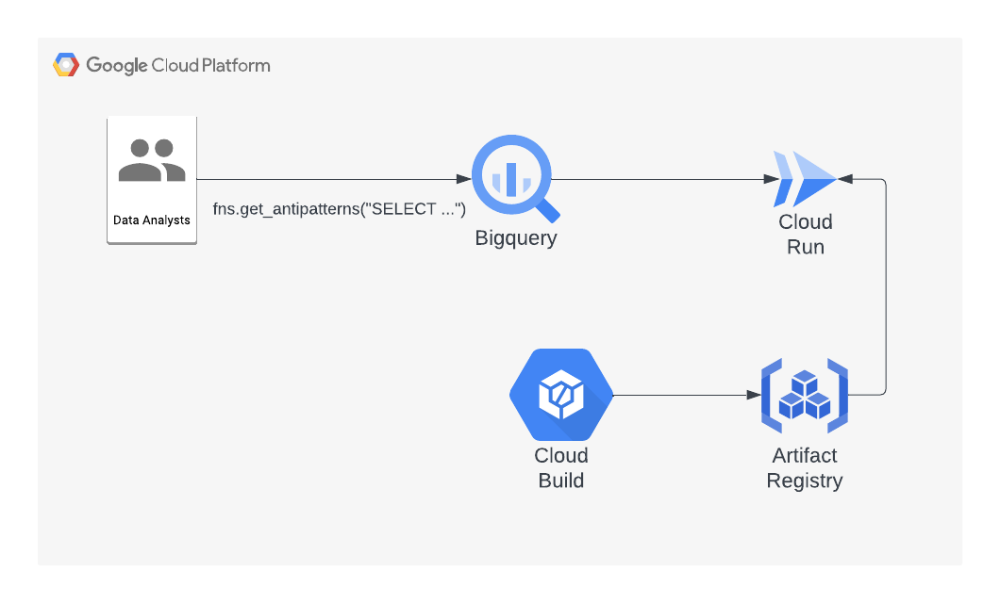

# BigQuery Anti-Pattern Recognition Remote Function UDF

**What this tool does:**

1. **Cloud Run Service:** Deploys a Cloud Run service that houses the anti-pattern detection logic.
2. **BigQuery Remote Function:** Creates a BigQuery User-Defined Function (UDF) that acts as a bridge between your SQL queries and the Cloud Run service.
3. **Anti-Pattern Detection:** When you call the BigQuery UDF, it sends your SQL query to the Cloud Run service, which analyzes it for anti-patterns. The result is returned in JSON format.




## Costs

This tutorial uses billable components of Google Cloud, including the following:

* [BigQuery](https://cloud.google.com/bigquery/pricing)
* [Cloud Build](https://cloud.google.com/build/pricing)
* [Cloud Run](https://cloud.google.com/run/pricing)

Use the [pricing calculator](https://cloud.google.com/products/calculator) to generate a cost estimate based on your
projected usage.

## Before you begin

For this tutorial, you need a Google Cloud [project](https://cloud.google.com/resource-manager/docs/cloud-platform-resource-hierarchy#projects).

1.  [Create a Google Cloud project](https://console.cloud.google.com/projectselector2/home/dashboard).
1.  Make sure that [billing is enabled](https://support.google.com/cloud/answer/6293499#enable-billing) for your Google
    Cloud project.
1.  [Open Cloud Shell](https://console.cloud.google.com/?cloudshell=true).

    At the bottom of the Cloud Console, a [Cloud Shell](https://cloud.google.com/shell/docs/features) session opens and
    displays a command-line prompt. Cloud Shell is a shell environment with the Cloud SDK already installed, including
    the [gcloud](https://cloud.google.com/sdk/gcloud/) command-line tool, and with values already set for your current
    project. It can take a few seconds for the session to initialize.

1.  In Cloud Shell, clone the source repository:

        git clone https://github.com/GoogleCloudPlatform/bigquery-antipattern-recognition.git
        cd bigquery-antipattern-recognition

2.  Enable all the required Google Cloud APIs

    ```shell
    gcloud services enable \
    artifactregistry.googleapis.com \
    bigquery.googleapis.com \
    bigqueryconnection.googleapis.com \
    cloudbuild.googleapis.com \
    run.googleapis.com
    ```

## Deployment script with Terraform

1.  Authenticate using User [Application Default Credentials ("ADCs")](https://cloud.google.com/sdk/gcloud/reference/auth/application-default) as a primary authentication method.
    ```shell
    gcloud auth application-default login
    ```

2.  Initialize and run the Terraform script to create all resources:

    ```shell
    cd ./udf/terraform && \
    terraform init && \
    terraform apply
    ```

## Deployment with Bash script

1.  Authenticate using User [Application Default Credentials ("ADCs")](https://cloud.google.com/sdk/gcloud/reference/auth/application-default) as a primary authentication method.
    ```shell
    gcloud auth application-default login
    ```
2.  Navigate to `udf/deploy_udf.sh` and modify your variable names for resources:

    ```shell
    PROJECT_ID="<PROJECT_ID>"
    REGION="<REGION_ID>"
    ARTIFACT_REGISTRY_NAME="<ARTIFACT_DOCKER_REGISTRY_NAME>"
    CLOUD_RUN_SERVICE_NAME="antipattern-service"
    BQ_FUNCTION_DATASET="fns"
    ```

3.  Run the Bash script to create all resources:

    ```shell
    bash /udf/deploy_udf.sh
    ```

## Using the UDF

Once the deployment script successfully completes resources creation,
visit [BigQuery Console](https://console.cloud.google.com/bigquery)
to run the test SQL script

```sql
SELECT fns.get_antipatterns("SELECT * from dataset.table ORDER BY 1")
```

The function returns a JSON string for each query representing the antipatterns found in each query, if any. For example the function would return the following response for the query above:

``` json
{
  "antipatterns": [
    {
      "name": "SimpleSelectStar",
      "result": "SELECT * on table: dataset.table. Check that all columns are needed."
    },
    {
      "name": "OrderByWithoutLimit",
      "result": "ORDER BY clause without LIMIT at line 1."
    }
  ]
}
```


## Detailed Deployment steps

In case you want to customize the deployment, please use following steps:

### Setting up your environment

1.  In Cloud Shell, set the [Cloud Region](https://cloud.google.com/compute/docs/regions-zones#available) that you want to create your BigQuery and Cloud Run resources in:

    ```shell
    PROJECT_ID="<PROJECT_ID>"
    REGION="<REGION_ID>"
    ARTIFACT_REGISTRY_NAME="<ARTIFACT_DOCKER_REGISTRY_NAME>"
    CLOUD_RUN_SERVICE_NAME="antipattern-service"
    ```


### Create Artifact Registry
This is a containerized SpringBoot application.
Create an [Artifact Registry](https://cloud.google.com/artifact-registry) to store the application's container image

```shell
gcloud artifacts repositories create "${ARTIFACT_REGISTRY_NAME}" \
--repository-format=docker \
--location="${REGION}" \
--description="Docker repository for Bigquery Functions" \
--project="${PROJECT_ID}"
```

### Deploy Cloud Run service

1. Build the application container image using [Cloud Build](https://cloud.google.com/build). You should run this at the root of the directory:
    ```shell
    gcloud builds submit . \
    --project="${PROJECT_ID}" \
    --config=cloudbuild-udf.yaml \
    --substitutions=_CONTAINER_IMAGE_NAME="${REGION}-docker.pkg.dev/${PROJECT_ID}/${ARTIFACT_REGISTRY_NAME}/${CLOUD_RUN_SERVICE_NAME}:latest" \
    --machine-type=e2-highcpu-8
    ```

2. Deploy Cloud Run by compiling and deploying Container :

    ```shell
    gcloud run deploy ${CLOUD_RUN_SERVICE_NAME} \
    --image="${REGION}-docker.pkg.dev/${PROJECT_ID}/${ARTIFACT_REGISTRY_NAME}/${CLOUD_RUN_SERVICE_NAME}:latest" \
    --region="${REGION}" \
    --no-allow-unauthenticated \
    --project ${PROJECT_ID}
    ```

1.  Retrieve and save the Cloud Run URL:

    ```shell
    RUN_URL="$(gcloud run services describe ${CLOUD_RUN_SERVICE_NAME} --region ${REGION} --project ${PROJECT_ID} --format="get(status.address.url)")"
    ```

### Create BigQuery Remote Function

1.  Create BigQuery connection for accessing Cloud Run:

    ```shell
    bq mk --connection \
    --display_name='External antipattern function connection' \
    --connection_type=CLOUD_RESOURCE \
    --project_id="${PROJECT_ID}" \
    --location="${REGION}" \
    ext-${CLOUD_RUN_SERVICE_NAME}
    ```

1.  Find the BigQuery Service Account used for the connection:

    ```shell
    CONNECTION_SA="$(bq --project_id ${PROJECT_ID} --format json show --connection ${PROJECT_ID}.${REGION}.ext-${CLOUD_RUN_SERVICE_NAME} | jq '.cloudResource.serviceAccountId')"
    ```

1.  Grant the BigQuery connection Service Account Cloud Run Invoker role for accessing the Cloud Run:

    ```shell
    gcloud projects add-iam-policy-binding ${PROJECT_ID} \
    --member="serviceAccount:${CONNECTION_SA}" \
    --role='roles/run.invoker'
    ```

### Create BQ Dataset for remote functions

1.  Define the BigQuery dataset to create remote functions:

    ```shell
    BQ_FUNCTION_DATASET="fns"
    ```

1.  Create the dataset if it doesn't exist:

    ```shell
    bq mk --dataset \
    --project_id ${PROJECT_ID} \
    --location ${REGION} \
    ${BQ_FUNCTION_DATASET}
    ```

### Create BigQuery Remote functions for Antipattern

1.  Create Antipattern remote function

    ```shell
    bq query --project_id ${PROJECT_ID} \
    --use_legacy_sql=false \
    "CREATE OR REPLACE FUNCTION ${BQ_FUNCTION_DATASET}.get_antipatterns(query STRING)
    RETURNS JSON
    REMOTE WITH CONNECTION \`${PROJECT_ID}.${REGION}.ext-${CLOUD_RUN_SERVICE_NAME}\`
    OPTIONS (endpoint = '${RUN_URL}');"
    ```


## Limitations

 *  Ensure BigQuery and Cloud Run service are in the same cloud region
 * The Antipattern remote function currently does not support the `--advanced-analysis` flag or AI rewrite.


